<<<<<<< HEAD
Miloiu Cristi 
Grupa 432A

> Documentatie Proiect Crud-App Typescript 

> Programarea Interfețelor pentru Baze de Date

Github:
https://github.com/cristim67/Crud-App

Link website:
(https://pibd.cristimiloiu.com/)

Introducere:

Proiectul are ca scop implementarea unui sistem de gestionare a datelor
pentru o instituție academică, folosind tehnologii moderne și eficiente.

Tehnologii utilizate:

Version Control: Git, Github, GitHub Actions.

**Git** oferă posibilitatea de urmărire a modificărilor în codul sursă
al proiectului. Acesta permite dezvoltatorilor să lucreze colaborativ,
gestionând schimbările în timp și furnizând un istoric detaliat al
fiecărei versiuni.

**Github** reprezintă o platformă de hosting pentru proiecte gestionate
cu ajutorul sistemului Git.

**GitHub** **Actions** este un serviciu oferit de GitHub pentru
automatizarea fluxurilor de lucru în cadrul proiectelor software.
Această platformă permite configurarea și rularea automată a diverselor
acțiuni în răspuns la evenimente specifice, cum ar fi push-uri, pull
requests sau crearea de tag-uri. GitHub Actions facilitează integrarea
continua (CI) și livrarea continua (CD) într-un mod flexibil și
personalizat.

Standardizarea și identificarea automată a erorilor: ESlint

**ESLint** este o unealtă de analiză statică a codului sursă pentru
JavaScript și TypeScript, utilizată pentru identificarea și corectarea
erorilor de stil, neregulilor și a altor probleme potențiale. ESLint
ajută la menținerea unui cod sursă curat, coerent și în conformitate cu
standardele definite de proiect și echipă.

Backend: Typescript, Genezio, Sequelize, Postgresql.

**Typescript** este un limbaj de programare tipizat care adaugă tipuri
statice peste JavaScript. Backend-ul este dezvoltat în TypeScript pentru
a asigura calitatea și corectitudinea codului, fiind mai ușor de scalat
pe viitor.

**Genezio** reprezintă o paradigmă de cloud native care facilitează
dezvoltarea simplificată a aplicațiilor moderne. Aceasta furnizează nu
doar opțiuni pentru găzduirea aplicațiilor, ci și o modalitate mai
accesibilă de a scrie backend-ul în clase, ce ulterior vor fi
implementate sub forma unei aplicații serverless.

**Sequelize** este un ORM (Object-Relational Mapping) pentru Node.js,
care facilitează interacțiunea cu bazele de date relaționale, cum ar fi
PostgreSQL, MySQL și SQLite. ORM-ul acționează ca un strat intermediar
între aplicația Node.js și baza de date, permițând dezvoltatorilor să
opereze cu datele utilizând obiecte și modele JavaScript în locul
limbajului specific bazei de date.

**Postgresql** este un sistem de gestiune a bazelor de date relaționale,
oferind o structură robustă pentru manipularea datelor. A fost ales
pentru a susține stocarea eficientă a informațiilor.

Frontend: React cu TypeScript, Vite și Tailwind CSS

**React** este o bibliotecă JavaScript pentru construirea interfețelor
de utilizator, iar TypeScript adaugă tipuri statice pentru a îmbunătăți
dezvoltarea și mentenanța codului.

**Vite** este un instrument de construire a proiectului React extrem de
rapid, care optimizează procesul de dezvoltare prin intermediul
importurilor ESM (ECMAScript Modules). Acesta oferă o experiență de
dezvoltare foarte eficientă. Sistemul de bundling fiind scris in Rust.

**Tailwind** **CSS** este un framework de CSS utilitar care permite
construirea rapidă și eficientă a interfețelor de utilizator. El
furnizează clase predefinite pentru stilizarea elementelor, facilitând
astfel procesul de dezvoltare.

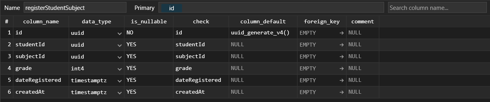

Implementare si functionalitati.

Baza de date este formată din 4 tabele. Structura acesteia fiind:

> A. Tabela studenți are următoarele coloane \[1\]:
>
> 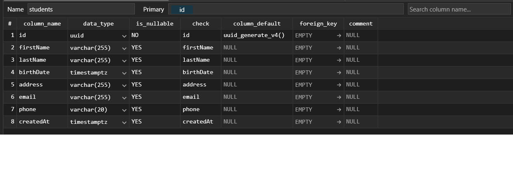
> Fig 1: Structură tabela studenți.
>
> B. Tabela subiecte are următoarele coloane \[2\].
>
> 
> 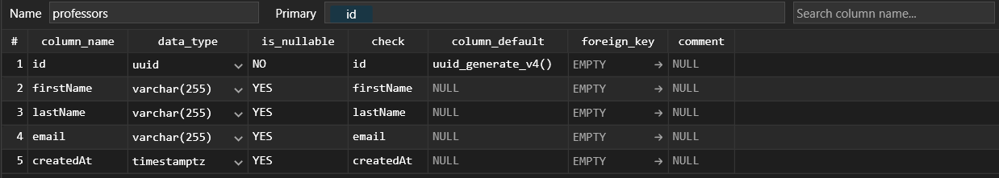
> Fig 2: Structura tabela subiecte.
>
> C. Tabela profesori are următoarele coloane \[3\].
>
> Fig 3: Structura tabela profesori
>
> D. RegisterStudentSubject
>
> Fig 4: Structura tabela înregistrare legatura student-subiect

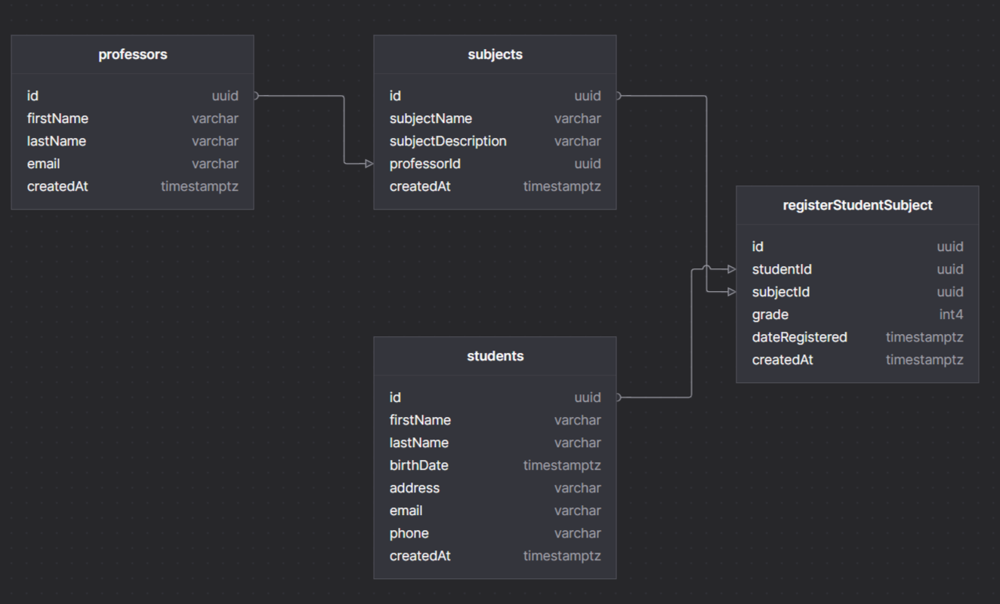
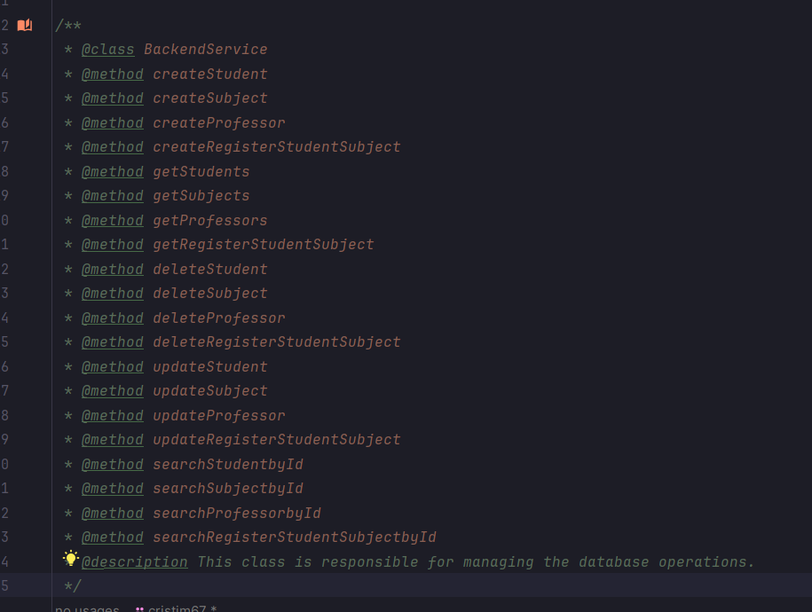

Diagrama bazei de date asociată tabelelor este reprezentată în figura de
mai jos \[5\]:

> Fig 5: Diagrama bazei de date

Pe partea de backend aplicația are o clasa care stie sa faca următoarele
operații \[6\]:

> Fig 6: Clasa BackendService, structura.

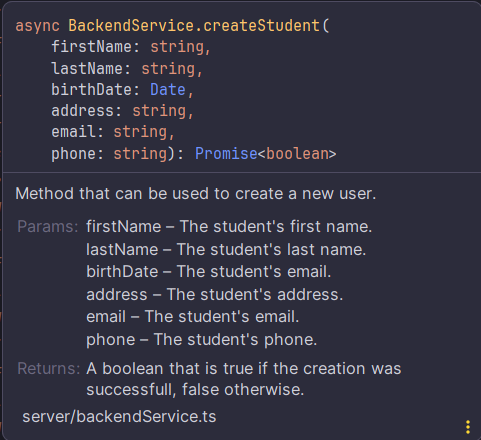
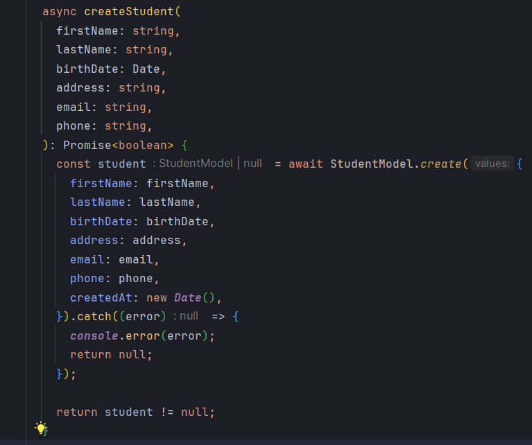
Functionalitati principale CRUD:

CRUD - Create, read, update, delete.

> A. Create - Functionalitatea oferă posibilitatea de a creare o
> entitate pentru oricare tabela existența.
>
> Exemplu - Crearea unui student \[7\],\[8\],\[9\].
>
> Fig 7: Descrierea metodei createStudent.
>
> Fig 8: Codul sursă al metodei createStudent.

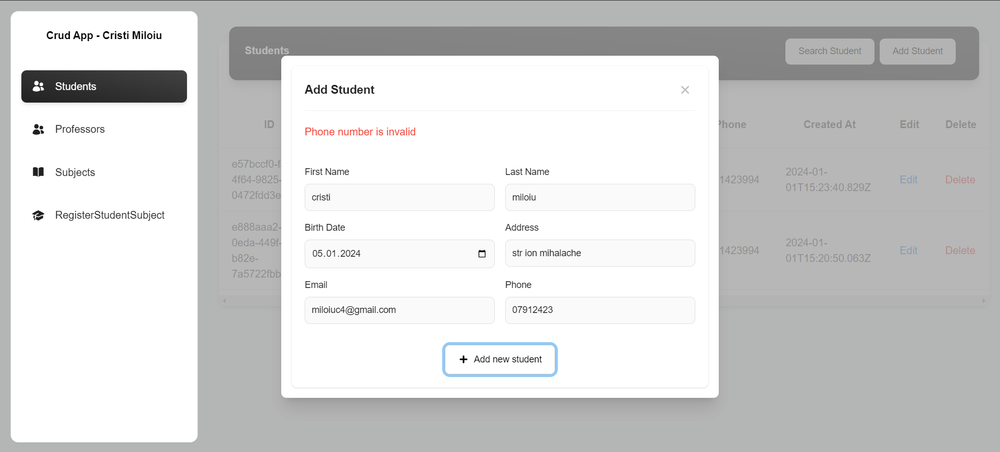
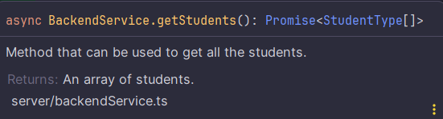
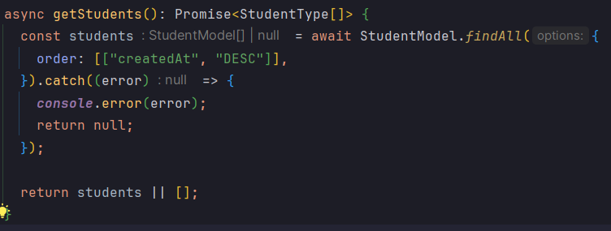
> Fig 9: Interfata grafica a Modalului pentru adaugarea unui student
>
> B. Read - Functionalitatea oferă posibilitatea de a citi, toate
> entitățile unei tabele.
>
> Exemplu - Citirea tuturor studentilor \[10\], \[11\], \[12\].
>
> Fig 10: Descrierea metodei getStudents.
>
> Fig 11: Codul sursă pentru metoda getStudents.

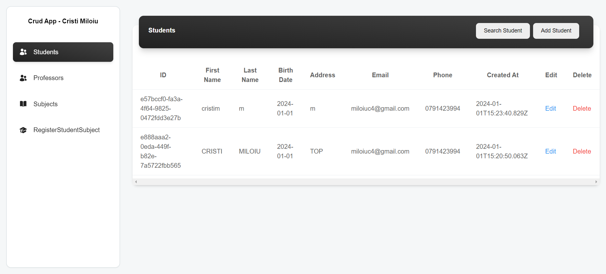
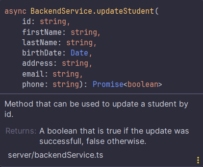
> Fig 12: Interfața grafica de afișare a studentilor.
>
> C. Update - Functionalitatea oferă posibilitatea de a edita
> proprietățile unei entități specifice.
>
> Exemplu - Modificarea datelor unui student \[12\], \[13\], \[14\].
>
> Fig 12: Descrierea metodei updateStudent.

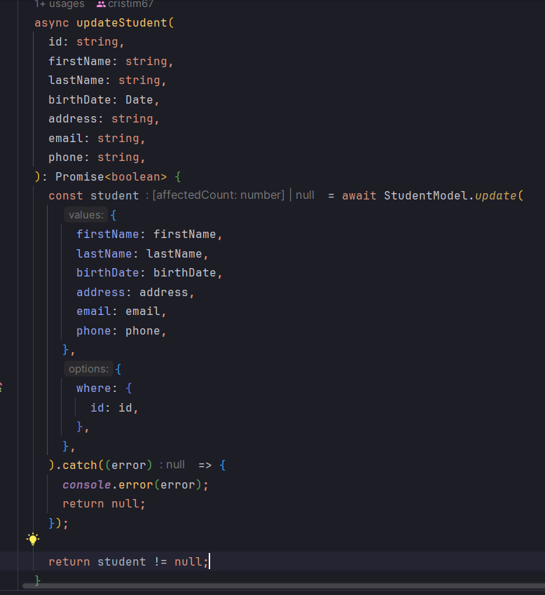

> Fig 13: Codul sursă pentru metoda updateStudent.

Fig14: Interfata grafica pentru Modalul care se ocupă cu actualizarea
unui student

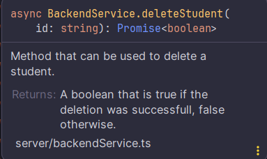
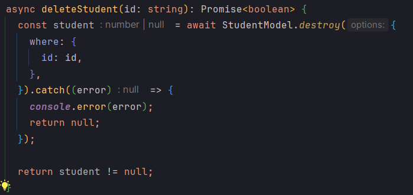

> D. Delete - Functionalitatea oferă posibilitatea de a șterge o
> entitate specifice.
>
> Exemplu - Ștergerea unui student \[14\], \[15\], \[16\].
>
> Fig 14: Descrierea metodei deleteStudent.
>
> Fig 15: Codul sursă pentru metoda deleteStudent.

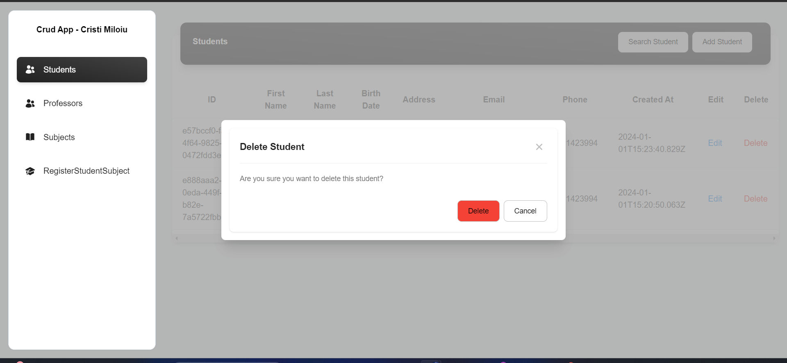

> Fig 16: Interfata grafica a Modalul de ștergere a unui student.
>
> Bibliografie:
>
> \-
> [[https://www.material-tailwind.com/]{.underline}](https://www.material-tailwind.com/) -
> [[https://vitejs.dev/guide/]{.underline}](https://vitejs.dev/guide/)
>
> \-
> [[https://docs.genez.io/genezio-documentation/]{.underline}](https://docs.genez.io/genezio-documentation/) -
> [[https://heroicons.com/]{.underline}](https://heroicons.com/)
>
> \-
> [[https://react.dev/reference/react]{.underline}](https://react.dev/reference/react) -
> [[https://neon.tech/]{.underline}](https://neon.tech/)
>
> \-
> [[https://docs.github.com/en]{.underline}](https://docs.github.com/en) -
> [[https://chat.openai.com/]{.underline}](https://chat.openai.com/)
=======
Crud-App
>>>>>>> b4bdaef8a4f3432e0d15c37782e6340cb1dfec81
